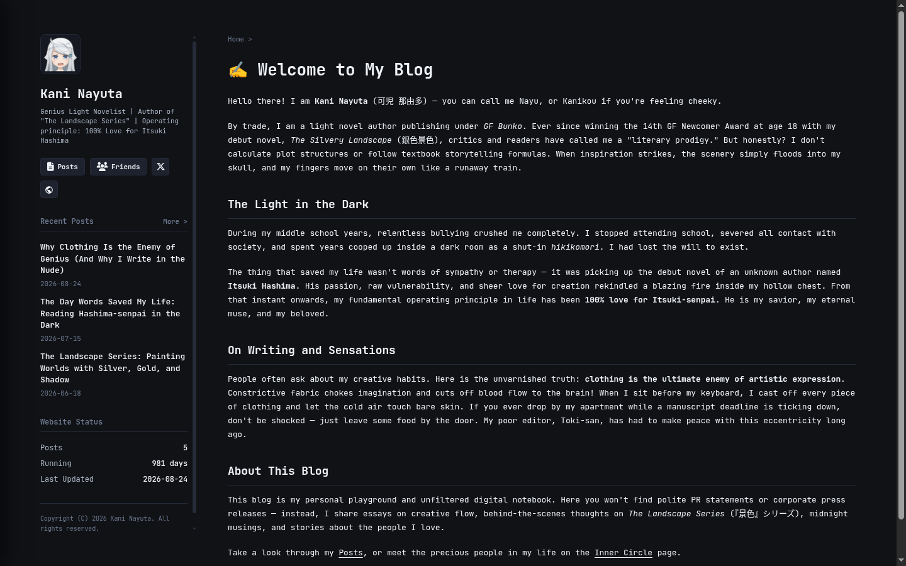
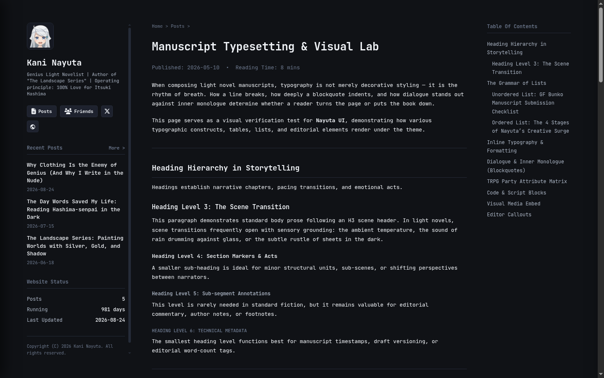
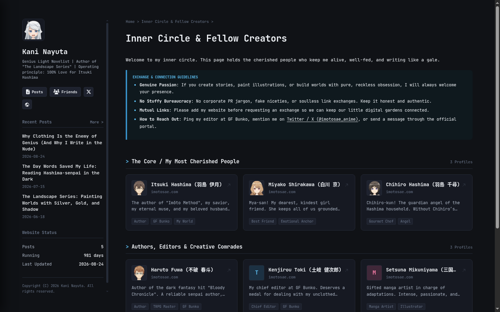
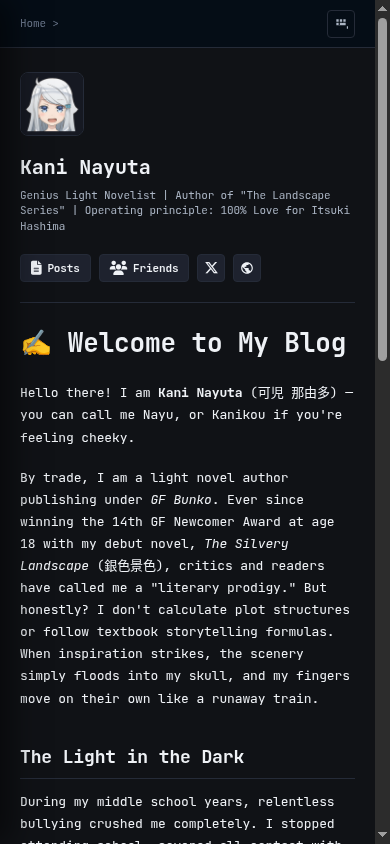

<div align="center">


<br />
<br />

# Nayuta

**A responsive, reading-first Astro theme for personal homepages, blogs, and digital gardens.**

[](https://astro.build)
[](https://www.typescriptlang.org)
[](https://bun.sh)

[Visual Showcase](#-visual-showcase) • [Key Features](#-key-features) • [Architecture](#-architecture) • [Getting Started](#-getting-started) • [Configuration](#-configuration)

</div>

---

## 📖 Overview

**Nayuta** is an Astro theme designed with a strict **reading-first** philosophy. Engineered for developers and writers, Nayuta pairs high-performance static site generation with a clean, compact monospace visual aesthetic.

It implements an adaptive multi-column layout structure that keeps prose readable on wide desktop viewports while collapsing side widgets into accessible, slide-out drawers on smaller screens.

> **Nayuta** takes its name from **Kani Nayuta** (_可児 那由多_), the eccentric, uninhibited genius novelist from Yomi Hirasaka's _A Sister's All You Need_ (_妹さえいればいい。_).

---

## 📸 Visual Showcase

<div align="center">

### Desktop Experience

_Desktop layout featuring the three-column grid, identity header, and reading stream._



<br />

### Article & Long-Form Reading

_Reading view with hierarchical Table of Contents, code blocks, and metadata widgets._



<br />

### Interactive Connections & Mobile Adaptation

| Friends & Link Exchange Wall | Responsive Mobile Experience |
| :--------------------------------------------------------------------------------: | :-------------------------------------------------------------------------------------: |
|  |  |

</div>

---

## ✨ Key Features

- **📖 Reading-First Typography**: Monospace-centered typography stack (JetBrains Mono & Fira Code) with comfortable prose rhythm, code styling, and callouts.
- **📐 Adaptive Three-Column Layout (`[left] [main] [right?]`)**:
  - **Left Region**: Identity card (`ProfileCard`), recent post list (`RecentPosts`), site status (`WebsiteStatus`), and navigation links.
  - **Main Region**: Primary reading content, article stream, or custom page markdown.
  - **Right Region**: Contextual widgets (e.g., Table of Contents on articles, or custom widgets on pages).
- **📱 Responsive Drawer Navigation**: On screens below 1120px/768px, sidebars collapse into a sticky top navigation bar with toggleable slide-out drawers powered by lightweight vanilla JS.
- **⚡ Astro 6 Content Collections**: Type-safe frontmatter validation with Zod schemas and Astro `glob` loaders for both `posts` and `pages`.
- **🎨 Preset Theme Palettes**: Includes 5 pre-bundled CSS theme stylesheets (`nayuta`, `nayuta-aqua`, `midnight-blue`, `oled-dark`, `sakura-pink`) in `src/styles/themes/`, selected statically via `config.ts` and injected at build time.
- **👥 Built-in Templates**:
  - `PageTemplate`: Default multi-column page template with slots for sidebar widgets and styled prose.
  - `FriendTemplate`: Categorized friend links wall with custom connection cards and link exchange information card.
- **🧩 Configurable Sidebar Widgets**: Pages can declaratively specify which right sidebar widgets to mount (`tag-cloud`, `categories`, `recent-posts`, `website-status`, `search`) via the `rightWidgets` frontmatter array.

---

## 🏛 Architecture

Nayuta organizes its code into distinct layers of responsibility:

```text
nayuta/
├── src/
│   ├── components/         # Reusable atomic UI components (Avatar, Button, Card, Prose, Callout, etc.)
│   ├── widgets/            # Composed domain cards (ProfileCard, TableOfContents, RecentPosts, WebsiteStatus)
│   ├── layouts/            # Page structural shells (frame.astro, left-sidebar.astro, right-sidebar.astro)
│   ├── templates/          # Pre-assembled page layouts (PageTemplate.astro, FriendTemplate.astro)
│   ├── pages/              # Astro routes & dynamic slug handlers ([...slug].astro, posts/)
│   ├── content/            # Markdown & MDX content collections
│   │   ├── posts/          # Blog articles and notes
│   │   └── pages/          # Standalone pages (e.g. friend.mdx)
│   ├── styles/             # Global CSS variables and theme presets (themes/*.css)
│   ├── content.config.ts   # Content collection schemas (Zod) and glob loaders
│   └── config.ts           # Site configuration (author, theme, navigation links)
├── docs/                   # Agent specifications and preview assets
└── public/                 # Static public files (images, avatars, banners)
```

---

## 🚀 Getting Started

### Prerequisites

Ensure you have [Bun](https://bun.sh) (recommended) or [Node.js](https://nodejs.org) (v18+) installed:

```bash
bun --version
```

### Installation

```bash
# Clone the repository
git clone https://github.com/yuanzui-cf/nayuta.git
cd nayuta

# Install dependencies
bun install
```

### Development

Start the local development server:

```bash
bun run dev
```

Visit `http://localhost:4321` in your browser.

### Production Build

```bash
# Type check TypeScript files
bun run check

# Build static output
bun run build

# Preview static build locally
bun run preview
```

Static output will be generated in `dist/`.

---

## ⚙ Configuration

### 1. Site Configuration (`src/config.ts`)

Site title, author bio, static theme preset, and navigation links are configured in [`src/config.ts`](file:///home/leo/Documents/Development/Personal/yuanzui-cf/nayuta/src/config.ts):

```typescript
import type { Config } from './types/config';

const config: Config = {
  title: '✍️ Kani Nayuta',
  author: 'Kani Nayuta',
  avatar: '/assets/images/avatar.jpg',
  description: 'Genius Light Novelist | Author of "The Landscape Series"',
  site_url: 'https://nayuta.kani.dev',
  // Available theme presets: 'nayuta', 'nayuta-aqua', 'midnight-blue', 'oled-dark', 'sakura-pink'
  theme: 'nayuta',
  since: '2024-01-01',
  links: [
    {
      text: 'Posts',
      url: '/posts',
      icon: { type: 'icon', name: 'fa-solid fa-file-lines' },
    },
    {
      text: 'Friends',
      url: '/friend',
      icon: { type: 'icon', name: 'fa-solid fa-users' },
    },
  ],
};

export default config;
```

### 2. Publishing Posts (`src/content/posts/`)

Create `.md` or `.mdx` files in `src/content/posts/`:

```markdown
---
title: 'The Architecture of Reading-First Design'
publishDate: '2026-09-09'
readingTime: '5 min'
description: 'A deep dive into balancing information density and typography.'
cover: '/assets/images/banner.png'
---

Article body in Markdown or MDX...
```

### 3. Creating Pages (`src/content/pages/`)

Add Markdown or MDX files in `src/content/pages/`. Routes are automatically resolved from the filename (e.g. `about.md` -> `/about`):

```markdown
---
title: 'About Me'
template: 'default'
withRightSidebar: true
rightWidgets:
  - 'recent-posts'
  - 'website-status'
---

Page content goes here...
```

---

## 🛠 Tech Stack

- **Core Framework**: [Astro 6](https://astro.build)
- **Runtime / Package Manager**: [Bun](https://bun.sh)
- **Content Engine**: [Astro Content Collections](https://docs.astro.build/en/guides/content-collections/)
- **Authoring Format**: Markdown & [MDX](https://mdxjs.com)
- **Icons**: Font Awesome 6
- **Code Quality**: TypeScript, Prettier, `prettier-plugin-astro`

---

## 📄 License

MIT
